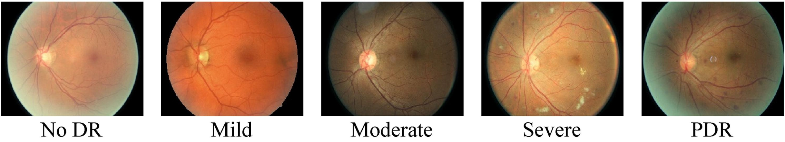

# Diabetic Retinopathy Classification



This challenge is about classifying Fundus photographies for Diabetic Retinopathy (DR) severity level:
- 0: No DR
- 1: Mild non-proliferative DR
- 2: Moderate non-proliferative DR
- 3: Severe non-proliferative DR
- 4: Proliferative DR


[Fundus photographies](https://en.wikipedia.org/wiki/Fundus_photography), as seen in the above figure, capture the rear of an eye, using a specialized camera consisting of a microscope attached to a flash.
[Diabetic retinopathy](https://en.wikipedia.org/wiki/Diabetic_retinopathy) is a medical condition caused by diabetes. The condition is a leading cause of blindness in developed countries and one of the leading causes of sight loss in the world.

This challenge is about developing a framework which correctly identifies the diabetic retinopathy severity level in fundus photos.

Your score will be calculated through a [Mean Absolute Error (MAE)](https://en.wikipedia.org/wiki/Mean_absolute_error). This is because, mis-classifying a fundus photo with **Proliferative DR (4)** as **No DR (0)** is much worse than mis-classifying it as **Severe non-proliferative DR (3)**:

Absolute Error Example 1:
- True severity level: **Severe non-proliferative DR (3)**
- Predicted severity level: **Proliferative DR (4)**
- Absolute Error: ∣3−4∣=1

Absolute Error Example 2:
- True severity level: **No DR (0)**
- Predicted severity level: **Proliferative DR (4)**
- Absolute Error: ∣0−4∣=4


The best possible MAE score is 0, which indicate that the predicted severity level (y) and true severity l level (x) corresponds for every single fundus image in the dataset. The score is formally defined as:

$$
\text{Score} = \text{MAE} = \frac{1}{N} \sum_{i=1} |x_i - y_i|
 $$

## Data Description

**TODO: ADD DESCRIPTION ABOUT THE IMAGES**. 

The datasets are split into 3 for the challenge:

* X training images
* Y validation images
* Z evaluation images

The training images can be found in /data/training with the corresponding labels found in data/training.csv formatted like:

```
image_name,true_class
00a8624548a9,2
00b74780d31d,2
00cb6555d108,1
0a09aa7356c0,2
0a1076183736,2
0a3202889f4d,1
```
Where image_name is the name of the image found in data/training/ and true_class is the Diabetic Retinopathy severity level, as described above. 

**TODO: The training images are currently taking from [Kaggle APTOS 2019 Blindness Detection](https://www.kaggle.com/datasets/sovitrath/diabetic-retinopathy-224x224-2019-data?resource=download&select=train.csv) and should be replace with our real data.**


## Evaluation
During the week of the competition, you will be able to validate your solution against the validation set. You can do this multiple times, however, **you can only submit to the evaluation set once!** The best validation and evaluation score your model achieves will be displayed on the <a href="https://cases.dmiai.dk"> scoreboard</a> . 
**We strongly encourage you to validate your code and API before you submit your final model to evaluation.**

When validating and evaluating, you will have 10 seconds per fundus photography image, before the server will time out the connection. Hence your model needs to be able to process an image within 10 seconds. 

## Quickstart
Clone the repository and change folder to the ct-inpainting challenge

```cmd
git clone https://github.com/amboltio/DM-i-AI-2025
cd DM-i-AI-2025/diabetic-retinopathy-classification
```
Install dependencies
```cmd
pip install -r requirements.txt
```

### Start your API endpoint
Serve your endpoint locally and test that everything starts without errors

```cmd
python api.py
```
Open a browser and navigate to http://localhost:4321. You should see a message stating that the endpoint is running. Navigate to http://localhost:4321/docs to see your endpoints.

### Make your endpoint visible to the validation and evaluation service
There are multiple options:
- **Local deployment** Ensure that the selected `PORT` on your network is open and redirecting traffic to your machine (this may not be possible depending on your network setup. Usually this involves changing settings in the admin panel of your router). 
- **Cloud deployment** Create a compute instance on Microsoft Azure, Google Cloud, Amazon Web Services (AWS) or other cloud providers. Repeat the steps above on the compute instance. 